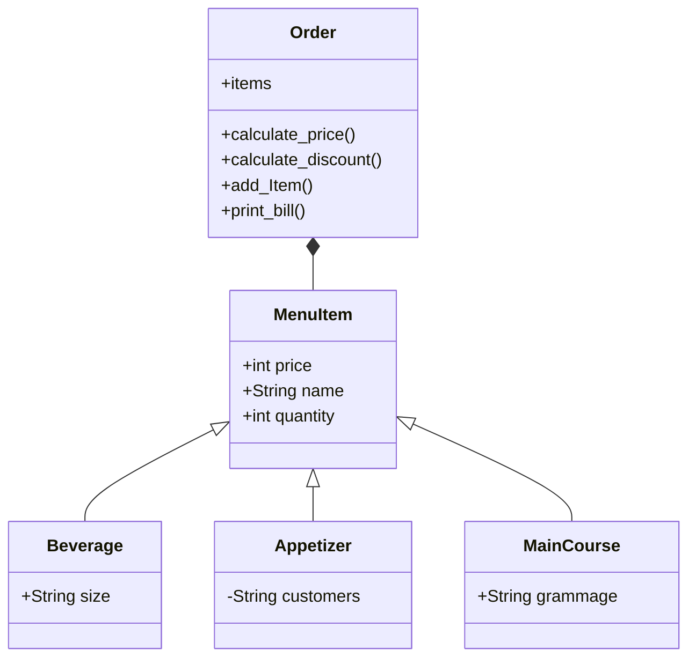

# Reto 3, Dilan Porras

## Restaurante


```python
class Order():
    def __init__(self) -> None:
        self.items = []
        self.total = None

    def calculate_price(self):
        self.total = sum([item.price * item.quantity for item in self.items])

    def calculate_discount(self, discount):
        self.discount = self.total * (discount / 100)
        self.total

    def add_item(self, item):
        self.items.append(item)

    def print_bill(self):
        for item in self.items:
            print(f"{item.name} - {item.price} - {item.quantity}")
        print("Descuento:", self.discount)
        print(f"Total: {self.total - self.discount}")

class MenuItem():
    def __init__(self, price, name, quantity) -> None:
        self.price = price
        self.name = name
        self.quantity = quantity

class Beverage(MenuItem):
    def __init__(self, price, size, name, quantity) -> None:
        super().__init__(price, name, quantity)
        self.size = size

class Appetizer(MenuItem):
    def __init__(self, price, customers, name, quantity) -> None:
        super().__init__(price, name, quantity)
        self.customers = customers

class MainCourse(MenuItem):
    def __init__(self, price, grammage, name, quantity) -> None:
        super().__init__(price, name, quantity)
        self.grammage = grammage


order = Order()
running = True

while running:
    selection = input("¿Desea ordenar un plato principal? (s/n): ")
    if selection == "s":
        print("""Platos principales:
        1. Hamburguesa sencilla
        2. Hamburguesa doble
        3. Hamburguesa ranchera
        4. Hamburguesa todo terreno
        """)
        main_course = int(input("Seleccione una opción: "))
        if main_course == 1:
            print("Hamburguesa sencilla seleccionada")
            order.add_item(MainCourse(12000, 150, "Hamburguesa sencilla", int(input("Cantidad: "))))
        elif main_course == 2:
            print("Hamburguesa doble seleccionado")
            order.add_item(MainCourse(16000, 300, "Hamburguesa doble", int(input("Cantidad: "))))
        elif main_course == 3:
            print("Hamburguesa ranchera seleccionada")
            order.add_item(MainCourse(20000, 200, "Hamburguesa ranchera", int(input("Cantidad: "))))
        elif main_course == 4:
            print("Hamburguesa todo terreno seleccionada")
            order.add_item(MainCourse(23000, 250, "Hamburguesa todo terreno", int(input("Cantidad: "))))            


    selection = input("¿Desea ordenar una entrada? (s/n): ")
    if selection == "s":
        print("""Entradas:
        1. Canasta de pan (3 personas)
        2. Sopa (1 persona)
        3. Papas fritas (5 personas)
        """)
        appetizer = int(input("Seleccione una opción: "))
        if appetizer == 1:
            print("Canasta de pan seleccionada")
            order.add_item(Appetizer(4000, 3, "Canasta de pan", int(input("Cantidad: "))))
        elif appetizer == 2:
            print("Sopa seleccionada")
            order.add_item(Appetizer(6000, 1, "Sopa seleccionada", int(input("Cantidad: "))))
        elif appetizer == 3:
            print("Papas fritas seleccionadas")
            order.add_item(Appetizer(8000, 5, "Papas fritas seleccionadas", int(input("Cantidad: "))))


    selection = input("¿Desea ordenar una bebida? (s/n): ")
    if selection == "s":
        print("""Bebidas:
        1. Agua
        2. Refresco
        3. Jugo
        """)
        beverage = int(input("Seleccione una opción: "))
        if beverage == 1:
            print("Agua seleccionada")
            order.add_item(Beverage(2000, 500, "Agua seleccionada", int(input("Cantidad: "))))
        elif beverage == 2:
            print("Refresco seleccionado")
            order.add_item(Beverage(3000, 500, "Refresco seleccionado", int(input("Cantidad: "))))
        elif beverage == 3:
            print("Jugo seleccionado")
            order.add_item(Beverage(5000, 600, "Jugo seleccionado", int(input("Cantidad: "))))

    selection = input("¿Desea ordenar algo más? (s/n)")
    if selection == 'n':
        running = False


order.calculate_price()

selection = input("¿Posee un cupón de descuento? (s/n): ")
if selection == "s":
    discount = int(input("Ingrese el valor porcentual descuento: "))
    order.calculate_discount(discount)

order.print_bill()
```

## Puntos, líneas, rectángulos
El código incluye un menú para seleccionar qué figura crear y qué acciones realizar.
```python
  
class Point:
    definition: str = "Abstract unit that represents a location in space"
    def __init__(self, given_x: float = 0, given_y: float = 0):
        self.x: float = given_x
        self.y: float = given_y
    def move(self, new_x, new_y):
        self.x = new_x
        self.y = new_y
    def reset(self):
        self.x = 0
        self.y = 0
    def compute_distance(self, point) -> float:
        return ((self.x - point.x)**2 + (self.y - point.y)**2 )**0.5
   
    def make_vector(self, point, direction):
        if direction == 0: #Self to point
            return (point.x - self.x, point.y - self.y)
        return (self.x - point.x, self.y - point.y)
   
    def __str__(self) -> str:
       return f"({self.x}, {self.y})"
   

class Line():
    def __init__(self, start: Point , end: Point) -> None:
        self.start = start
        self.end = end
        self.lenght = self.compute_lenght()
        self.slope = self.compute_slope()

        self.left = min(self.start.x, self.end.x)
        self.right = max(self.start.x, self.end.x)
        self.top = max(self.start.y, self.end.y)
        self.bottom = min(self.start.y, self.end.y)
        self._cutY = self.__calculate_cutY()

        self.vector = self.start.make_vector(self.end, 0)
        

    def compute_lenght(self):
        return self.start.compute_distance(self.end)
    
    def compute_slope(self):
        if self.start.x - self.end.x == 0:
            return None
        return (self.start.y - self.end.y)/ (self.start.x - self.end.x)

    def compute_horizontal_cross(self):
        return (self.left <= 0 and self.right >= 0)
    
    def compute_vertical_cross(self):
        return (self.bottom <= 0 and self.top >= 0)
    
    def __calculate_cutY(self):
        if self.slope == None:
            return None
        return self.start.y - self.slope * self.start.x

    def line_function(self, x):
        if self.left <= x <= self.right:
            b = self.start.y - self.slope * self.start.x
            return x*self.slope + b
        else:
            return None
    
    def intersection_line(self, line):
        if self.slope == line.slope:
            if self.slope == None:
                return self.start.x == line.start.x
            else:
                return self._cutY == line._cutY and (self.left <= line.right) and (self.right >= line.left)
        
        cut_point = (line._cutY - self._cutY) / (self.slope - line.slope)
        return (self.left < cut_point < self.right) and (line.left < cut_point < line.right)

    def discretize_line(self, n:int):
        domain = self.right - self.left
        increment = domain/n

        self.equally_spaced_points = []
        for i in range(1, n+1):
            x = self.left + increment * i
            y = self.line_function(x)
            self.equally_spaced_points.append( Point(x,y) ) 

        return self.equally_spaced_points


class Rectangle():
    def __init__(self, method:int, args: list) -> None:
        if method == 1:
            self.method1(*args)
            self.__define_lines()
        elif method == 2:
            self.method2(*args)
            self.__define_lines()
        elif method == 3:
            self.method3(*args)       
            self.__define_lines()
        elif method == 4:
            self.method_line(*args)
        else: print("no method")
        
        self.type = "Rectangle"

 
        
        

    def method1(self, bottom_left, width, height):
        self.width = width
        self.height = height
        self.bottom_left = bottom_left

        self.center = Point( bottom_left.x + self.width/2, bottom_left.y + self.height/2   )
        self.bottom_right = Point(self.bottom_left.x+width, self.bottom_left.y)
        self.top_left = Point(self.bottom_left.x, self.bottom_left.y+height)
        self.top_right = Point(self.bottom_right.x, self.top_left.y)

        self.points = [self.bottom_left, self.top_left, self.top_right, self.bottom_right]


    def method2(self, center, width, height):
        self.center = center
        self.width = width
        self.height = height
        self.bottom_left = Point(self.center.x-(self.width/2), self.center.y-(self.height/2))
        self.bottom_right = Point(self.bottom_left.x+width, self.bottom_left.y)
        self.top_left = Point(self.bottom_left.x, self.bottom_left.y+height)
        self.top_right = Point(self.bottom_right.x, self.top_left.y)

        self.points = [self.bottom_left, self.top_left, self.top_right, self.bottom_right]

    def method3(self, first_point, second_point):
        left = min(first_point.x, second_point.x)
        bottom = min(first_point.y, second_point.y)
        self.width = abs(first_point.x - second_point.x)
        self.height = abs(first_point.y - second_point.y)
        self.center = Point( left + self.width/2, bottom + self.height/2  )
        self.bottom_left = Point(left, bottom)
        self.bottom_right = Point(self.bottom_left.x+self.width, self.bottom_left.y)
        self.top_left = Point(self.bottom_left.x, self.bottom_left.y+self.height)
        self.top_right = Point(self.bottom_right.x, self.top_left.y)

        self.points = [self.bottom_left, self.top_left, self.top_right, self.bottom_right]

    def method_line(self, *lines):
        if len(lines) != 4:
            return False
        self.lines = lines

        self.width = lines[0].lenght 
        if self.width != lines[1].lenght:
            self.height = lines[2].lenght
        else:
            self.height = lines[1].lenght

        mostleft = lines[0].left
        mostright = lines[0].right
        mosttop = lines[0].top
        mostbottom = lines[0].bottom

        self.points = [line.start for line in self.lines]
        for line in self.lines:
            if mostleft > line.left:
                mostleft = line.left
            if mostright < line.right:
                mostright = line.right
            if mosttop < line.top:
                mosttop = line.top
            if mostbottom > line.bottom:
                mostbottom = line.bottom

            
        self.center = Point( mostleft + (mostright - mostleft)/2,  mostbottom + (mosttop - mostbottom)/2  )
        

    def __define_lines(self):
        self.left = self.center.x - self.width/2
        self.right = self.center.x + self.width/2
        self.top = self.center.y + self.height/2
        self.bottom = self.center.y - self.height/2
        self.lines = [Line(self.bottom_left, self.bottom_right), Line(self.top_left, self.top_right), Line(self.bottom_left, self.top_left), Line(self.bottom_right, self.top_right)]


    def compute_area(self) -> float:
        return self.width * self.height
    
    def compute_perimeter(self) -> float:
        return self.width * 2 + self.height * 2
    
    def compute_interference_point(self, point:Point) -> bool:
        
        for start in self.points:
            main_vector = start.make_vector(point, 0)
            for vertex in self.points:
                line_vector = start.make_vector(vertex, 0)
                product = line_vector[0] * main_vector[0] + line_vector[1] * main_vector[1]
                if not (product >= 0):
                    return False
        return True

    
    def compute_interference_line(self, line):
        
        if self.compute_interference_point(line.start) or self.compute_interference_point(line.end):
            return True
        
        for i in range(4):
            if self.lines[i].intersection_line(line):
                return True
        return False


class Square(Rectangle):
    def __init__(self, center:list, width: float) -> None:
        super().__init__(2, [center, width, width])
        self.type = "Square"


#INTERFACE

def point_request(txt="Enter point, componets separed by ',': "):
    return Point(*[float(x) for x in input(txt).split(",")])


def inicio():
    print("""What do you want to create?
    1. Rectangle.
    2. Square.
    3. Line
    0. Exit""")

    select = int(input("Enter the number of your selection: "))
    if select == 1:
        print("""Choose a method:
            Method 1: Bottom-left corner(Point) + width and height
            Method 2: Center(Point) + width and height
            Method 3: Two opposite corners (Points) e.g. Bottom-left and Upper-right
            Method 4: Four lines that collide """)
        method = int(input("Number of the method: "))
        if method == 1:
            bottom_left = point_request("Enter bottom left, componets separed by ',': ")
            width = float(input("Enter width: "))
            height = float(input("Enter height: "))
            return Rectangle(1, [bottom_left, width, height])
        elif method == 2:
            center = point_request("Enter center, componets separed by ',': ")
            width = float(input("Enter width: "))
            height = float(input("Enter height: "))
            return Rectangle(2, [center, width, height])
        elif method == 3:
            corner1 = point_request("Enter corner 1, componets separed by ',': ")
            corner2 = point_request("Enter corner 2, componets separed by ',': ")
            return Rectangle(3, [corner1, corner2])
        elif method == 4:
            lines = []
            for i in range(4):
                print(f"Line {i+1}: ")
                lines.append(Line(point_request("Enter point 1, components separated by ',': "), point_request("Enter point 2, components separated by ',': ")))
            return Rectangle(4, lines)
        else:
            print("Try again")
            return inicio()

        
    elif select == 2:
        center = Point(*[float(x) for x in input("Enter center, componets separed by ',': ").split(",")])
        width = float(input("Enter width/height: "))
        return Square(center, width)
    
    elif select == 3:
        start = Point(*[float(x) for x in input("Enter first point, components separed by ',': ").split(",")])
        end = Point(*[float(x) for x in input("Enter second point, components separed by ',': ").split(",")])
        return Line(start, end)

    elif select == 0:
        exit()
    else:
        print("Try again")
        return inicio()


rect = inicio()

def bucle(rect):

    menu = """What do you want to do?
    1. Define a figure.
    2. Get the characteristics of the rectangle.
    3. Get area.
    4. Get perimeter.
    5. Calculate interference point
    6. Calculate interference line
    7. Discretize line (Only for lines)
    0. Exit"""

    running = True

    while running:
        print(menu)
        select = int(input("Enter the number of your selection: "))
        if select == 1:
            rect = inicio()
        elif select == 2:
            print("Center:", rect.center, "\n", "Width;", rect.width, "\n", "Height:", rect.height)
        elif select == 3:
            print("Area:", rect.compute_area())
        elif select == 4:
            print("Perimeter:", rect.compute_perimeter())
        elif select == 5:
            point = point_request()
            print("The point" + (" interferes" if rect.compute_interference_point(point) else " does not interfer") + " with the " + rect.type ) 
        elif select == 6:
            point1 = point_request("Enter first point, components separed by ',': ")
            point2 = point_request("Enter second point, components separed by ',': ")
            print("The line" + (" interferes" if rect.compute_interference_line(Line(point1, point2)) else " does not interfer") + " with the " + rect.type)
        elif select == 7:
            if isinstance(rect, Line):
                points = rect.discretize_line(int(input("Number of points: ")))
                print( [str(x) for x in points])
        elif select == 0:
            running = False
        
        print("\n-------------------\n")

bucle(rect)

```
