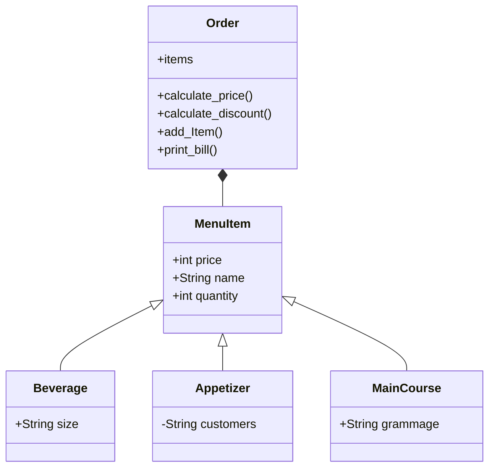

# Reto 3, Dilan Porras

```mermaid
  classDiagram
      MenuItem <|-- Beverage
      MenuItem <|-- Appetizer
      MenuItem <|-- MainCourse
      MenuItem : +int price
      MenuItem : +String name
      MenuItem : +int quantity
      class Beverage{
        +String size
            }
      class Appetizer{
        -String customers
      }
      class MainCourse{
        +String grammage
      }
  
      class Order {
          +items
          +calculate_price()
          +calculate_discount()
          +add_Item()
          +print_bill()
      }
  
      Order*-- MenuItem
```
